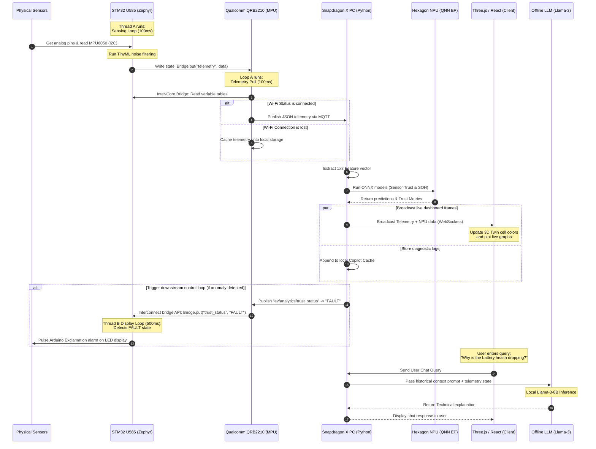

# EV Guardian AI: End-to-End System Flow & Architectural Specification

This document provides a comprehensive technical blueprint of the **EV Guardian AI** battery monitoring and diagnostics pipeline. The architecture integrates low-latency, deterministic sensing with edge AI inference on Qualcomm NPUs, a local LLM diagnostics co-pilot, a web-based 3D digital twin dashboard, and cloud analytics.

---

## 1. System Topology Overview

```mermaid
graph TD
    %% Hardware Layer
    subgraph Edge_Node ["Arduino UNO Q (Edge Gateway Node)"]
        subgraph STM32_MCU ["STM32U585 Core (Zephyr RTOS)"]
            Sensors["Physical Sensors<br/>(Cells, ACS712, Thermistors, MQ-2, MPU6050)"]
            ADC["Zephyr ADC Driver"]
            I2C["Zephyr I2C Driver"]
            ThreadA["Thread A: Sensing & Filter (100ms)"]
            ThreadB["Thread B: Display Matrix (500ms)"]
            LED["8x13 LED Matrix Screen"]
        end
        
        subgraph Inter_Core_Bridge ["Inter-Core RPC Gateway"]
            SharedMemory[("Shared IPC Memory registers")]
        end

        subgraph Qualcomm_MPU ["QRB2210 MPU Core (Debian Linux)"]
            LoopA["Loop A: Telemetry Pull & MQTT Push"]
            LoopB["Loop B: MQTT Listener Daemon"]
            Storage["Local Storage<br/>(Store-and-Forward Cache)"]
            BLE["BLE Emergency Broadcast Service"]
        end
    end

    %% Network & Edge Host
    subgraph offline_PC ["Snapdragon X Copilot+ PC (Edge Host - Local Vehicle Hub)"]
        Broker["Local Mosquitto MQTT Broker"]
        PyBackend["Local Python Ingestion Engine"]
        FeatureExtractor["Feature Extractor Vectorizer"]
        
        subgraph Inferences ["Hexagon NPU (ONNX Runtime + QNN EP)"]
            TrustModel["Sensor Trust Model (ONNX)"]
            SOHModel["State of Health Model (ONNX)"]
        end

        WS["WebSocket Broadcast Server"]
        CopilotCache[("Local Copilot Context Buffer")]
        LLMServer["Local LLM Server (Ollama Llama-3-8B)"]
        DigitalTwin["React + Three.js 3D Digital Twin UI"]
    end

    %% Cloud Infrastructure
    subgraph Cloud_Platform ["Qualcomm Cloud AI 100 Datacenter"]
        LogAggregator["Fleet Data Aggregator"]
        RetrainPipeline["Deep AI Model Retraining Engine"]
    end

    %% Connections
    Sensors -->|Analog Volts| ADC
    Sensors -->|Digital I2C| I2C
    ADC --> ThreadA
    I2C --> ThreadA
    ThreadA -->|Bridge.put| SharedMemory
    SharedMemory -->|Bridge.get| ThreadB
    ThreadB --> LED
    
    SharedMemory <-->|Qualcomm Hardware Interconnect| LoopA
    LoopA -->|File Write if Offline| Storage
    LoopA -->|Local Radio Broadcast| BLE
    SharedMemory <-->|Bridge.put / Bridge.get| LoopB
    
    LoopA -->|Wi-Fi 5 / MQTT| Broker
    Broker --> PyBackend
    PyBackend --> FeatureExtractor
    FeatureExtractor -->|Vector [1, 8]| TrustModel
    FeatureExtractor -->|Vector [1, 8]| SOHModel
    
    TrustModel -->|Trust Scores %| WS
    SOHModel -->|SOH Predictions %| WS
    TrustModel & SOHModel --> CopilotCache
    
    WS -->|Live Telemetry Frames| DigitalTwin
    CopilotCache -->|Injected RAG Prompt| LLMServer
    DigitalTwin <-->|User Diagnostics Query| LLMServer
    
    LoopB <--|JSON Status Update| Broker
    PyBackend -->|Calculated status alert| Broker
    
    PyBackend -->|Historical Log Sync| LogAggregator
    LogAggregator --> RetrainPipeline
    RetrainPipeline -->|OTA ONNX Model Updates| Inferences
```

---

## 2. STM32 Firmware & Zephyr RTOS Sensing Layer

The STM32U585 microcontroller performs high-speed, deterministic sampling. The software model is built on **Zephyr RTOS** utilizing multitasking threads.

### 2.1 Sensor Specifications & Physical Interfaces

*   **Cell Voltages (1-4)**: Resistor dividers (e.g. 10k/10k) scale cell potentials (up to 4.2V nominal, 16.8V pack level) down to the ADC dynamic range ($0 - 3.3\text{V}$).
*   **Current Sensor (ACS712-05B)**: Hall-effect current monitoring. Centered at $V_{cc}/2$ ($2.5\text{V}$) for $0\text{A}$, with a sensitivity slope of $185\text{mV/A}$.
*   **Temperature (Thermistor/NTC)**: Connected as a low-side divider with a $10\text{k}\Omega$ pull-up. The resistance is calculated to Celsius via the Steinhart-Hart equation.
*   **Gas Sensor (MQ-2)**: Metal-oxide semiconductor heater monitoring structural volatility (combustible gases, smoke).
*   **Vibration (MPU6050)**: Digital MEMS IMU. Registers values over a physical I2C bus at 400 kHz.

### 2.2 Low-Level Driver Register Details (Zephyr ADC & I2C)

#### ADC Configuration (`adc.h` / `adc_stm32.c`)
To minimize impedance interference and avoid voltage sag due to charge transfer on the ADC sample-and-holding capacitor (Ghost Charge Drainage), the sample time is extended.
*   **Prescaler**: Devised to run the peripheral at $12\text{MHz}$ for maximum SAR resolution.
*   **Sampling Time Control**: Set to **160** ADC cycles to accommodate high source resistance.

```c
/* Zephyr devicetree & API configuration */
#define ADC_NODE DT_NODELABEL(adc1)
static const struct device *adc_dev = DEVICE_DT_GET(ADC_NODE);

static const struct adc_channel_cfg ch_cfg = {
    .gain = ADC_GAIN_1,
    .reference = ADC_REF_INTERNAL, // 3.3V INTVCC
    .acquisition_time = ADC_ACQ_TIME(ADC_ACQ_TIME_TICKS, 160),
    .channel_id = 0,
    .differential = 0
};
```

#### I2C Configuration (`i2c.h`)
*   **Baudrate**: $400\text{kHz}$ Fast Mode (`I2C_SPEED_FAST`).
*   **MPU6050 Address**: `0x68`.

```c
#define I2C_NODE DT_NODELABEL(i2c1)
static const struct device *i2c_dev = DEVICE_DT_GET(I2C_NODE);

/* Initialize and configure MPU6050 Power Management Register */
uint8_t mpu_init_cmd[] = {0x6B, 0x00}; // Wake up device
i2c_write(i2c_dev, mpu_init_cmd, 2, 0x68);
```

### 2.3 Sensing Loop Thread (Thread A - Run Every 100ms)

Thread A performs the following sequential actions:
1.  **Sequence ADC Conversions**: Iterates across Channels 0 to 5.
2.  **Poll I2C Sensor**: Reads high/low bytes of Accelerometer registers (`0x3B` to `0x40`) for X, Y, and Z axes.
3.  **Physical Voltage & Units Scaling**:
    *   **Cell Voltages**:
        $$V_{cell} = \frac{ADC_{raw}}{4095} \times 3.3 \times \text{ScaleFactor}$$
    *   **Current Sensor**:
        $$I = \frac{(ADC_{raw} \times 3.3 / 4095) - 2.5}{0.185}$$
    *   **Temperature**:
        $$R_{NTC} = R_{pullup} \times \left(\frac{4095}{ADC_{raw}} - 1\right)$$
        $$T_C = \frac{1}{\frac{1}{T_0} + \frac{1}{\beta}\ln(R_{NTC}/R_0)} - 273.15$$
    *   **Vibration Magnitude**:
        $$Acc_{G} = \frac{\sqrt{X_{raw}^2 + Y_{raw}^2 + Z_{raw}^2}}{\text{SensitivityScale}}$$
4.  **TinyML / Filtering Layer**: Runs a fast 5-tap moving median filter locally on each sensor signal buffer to suppress high-frequency hardware switching spikes.
5.  **IPC Shared Update**: Invokes the Inter-Core Interconnect `Bridge.put()` to dump the vector table into dual-port shared SRAM.

```c
// Pseudocode of Thread A Loop
void sensing_thread_entry(void *p1, void *p2, void *p3) {
    struct battery_telemetry_t raw_data;
    struct filtered_telemetry_t filtered_data;
    
    while(1) {
        // 1. Read Analog Pins
        raw_data.cell_v[0] = read_adc(CH_CELL1);
        raw_data.cell_v[1] = read_adc(CH_CELL2);
        raw_data.cell_v[2] = read_adc(CH_CELL3);
        raw_data.cell_v[3] = read_adc(CH_CELL4);
        raw_data.current   = read_adc(CH_CURRENT);
        raw_data.temp      = read_adc(CH_TEMP);
        raw_data.gas       = read_adc(CH_GAS);
        
        // 2. Read Digital I2C Vibration
        read_mpu6050_accel(i2c_dev, &raw_data.accel_x, &raw_data.accel_y, &raw_data.accel_z);
        
        // 3. Unit Scaling & Low-pass Median Filtering
        filtered_data = apply_calibration_and_filters(raw_data);
        
        // 4. Update Shared Registers
        Bridge.put("telemetry", &filtered_data, sizeof(filtered_data));
        
        k_msleep(100);
    }
}
```

### 2.4 Display Loop Thread (Thread B - Run Every 500ms)

Thread B monitors the safety flag returned by the Host PC and controls the on-board user interface.
1.  **Read Status Flag**: Retrieves the value of `"trust_status"` from shared registers using `Bridge.get()`.
2.  **Display Decision**:
    *   **If State == FAULT**: Commits the 8x13 LED Matrix driver channels to strobe a flashing visual alarm indicator (`!`) at 2 Hz.
    *   **If State == OK**: Steps an animated LED charge scroll sequence representing cellular energy levels.

---

## 3. Qualcomm Dragonwing MPU (Debian Linux Gateway)

The Qualcomm QRB2210 Dragonwing MPU functions as the gateway bridge, routing data from the local shared memory interface to external endpoints over standard networking protocols.

### 3.1 Inter-Core Core Bridge Interface Layout

```
[ STM32 SRAM MEMORY MAP ] 
┌─────────────────────────┬────────────┬────────────────────────────┐
│ Hex ID Address Range    │ Lock Bits  │ Parameter Map Target       │
├─────────────────────────┼────────────┼────────────────────────────┤
│ 0x20000000 - 0x200000FF │ Volatile   │ Raw Shared Sensor Telemetry│
│ 0x20000100 - 0x2000011F │ Locked     │ Trust Status Flag (R/W)    │
│ 0x20000120 - 0x200002FF │ Volatile   │ System Configurations      │
└─────────────────────────┴────────────┴────────────────────────────┘
```

### 3.2 Loop A Daemon: Telemetry Extraction & Broadcaster

Operating in a background loop at $10\text{Hz}$ (every $100\text{ms}$), Loop A manages the transmission of telemetry data.

*   **Online State (Publisher)**: Reads telemetry from shared registers using `Bridge.get()`, structures it as a JSON payload, and publishes it via MQTT.
*   **Store-and-Forward Caching Handler (Offline State)**: If the local Wi-Fi link drops or the MQTT broker connection fails, the daemon switches to fallback mode. Instead of discarding data, it appends the JSON string onto an onboard eMMC cache file. When connections are restored, a spooler thread uploads the cached historical data.
*   **BLE Emergency Service**: Concurrently writes safety state fields to a GATT Server characteristic, broadcasting local alerts to smartphones or hand-held diagnostic terminals.

```python
# Loop A Daemon Logic
import time
import json
import logging
from bridge_api import Bridge
from mqtt_client import MQTTClient

class TelemetryGateway:
    def __init__(self):
        self.bridge = Bridge()
        self.mqtt = MQTTClient("qrb2210-gateway", broker_ip="192.168.1.50")
        self.cache_file = "/var/log/telemetry_cache.json"

    def run(self):
        self.mqtt.connect()
        while True:
            # 1. Pull data from STM32 Shared registers
            telemetry_data = self.bridge.get("telemetry")
            
            payload = {
                "timestamp": int(time.time() * 1000),
                "device_id": "ev-guardian-01",
                "cells": {
                    "voltage_v": telemetry_data.cell_v,
                    "temp_c": telemetry_data.temp_c
                },
                "pack": {
                    "current_a": telemetry_data.current,
                    "gas_ppm": telemetry_data.gas,
                    "vibration_g": telemetry_data.vibration
                }
            }

            # 2. Transmit or Store
            if self.mqtt.is_connected():
                self.mqtt.publish("ev/sensor/telemetry", json.dumps(payload))
                self.flush_offline_cache()
            else:
                self.cache_offline_telemetry(payload)
                
            # 3. BLE Emergency Beacon updates
            self.update_ble_characteristic(payload)

            time.sleep(0.1)
```

### 3.3 Loop B Daemon: Downstream Listener Daemon

Loop B remains idle until triggered by incoming messages on the subscribed MQTT topic `"ev/analytics/trust_status"`.
1.  **Event Callback**: Receives state updates from the Snapdragon X PC.
2.  **Register Write**: Extracts the payload value and calls `Bridge.put("trust_status", state)` to propagate the alert status back to the STM32 display thread.

---

## 4. Snapdragon X Copilot+ PC (Edge AI Core)

The Snapdragon X PC serves as the central orchestration node, processing telemetry data in real-time, executing machine learning models on the Hexagon NPU, and hosting the dashboard and LLM interfaces.

```
       MQTT Telemetry Payload
                 │
                 ▼
     ┌──────────────────────┐
     │ Ingestion & Parsing  │
     └───────────┬──────────┘
                 │
                 ▼
     ┌──────────────────────┐
     │  Feature Extractor   │
     │  1x8 Flattened Array │
     └───────────┬──────────┘
                 │
         ┌───────┴───────┐
         ▼               ▼
   Sensor Trust         SOH
    Classifier       Regressor
   ┌───────────┐    ┌───────────┐
   │  Hexagon  │    │  Hexagon  │
   │    NPU    │    │    NPU    │
   └─────┬─────┘    └─────┬─────┘
         │                │
         ▼                ▼
     Calculated       Estimated
    Anomaly %          SOH %
         │                │
         └───────┬────────┘
                 │
                 ▼
     ┌──────────────────────┐
     │ WebSocket Broadcast  │
     └───────────┬──────────┘
         ┌───────┼──────────────────────┐
         ▼       ▼                      ▼
     3D Twin  Database             Copilot Cache
    (ThreeJS) (SQLite)            (Rolling Window)
                                        │
                                        ▼
                                 Context-Injected
                                    LLM Prompt
                                 ┌──────────────┐
                                 │   Llama-3    │
                                 │ (Ollama Spec)│
                                 └──────────────┘
```

### 4.1 Telemetry Ingestion & Feature Vectorizer

1.  **MQTT Subscription**: Ingests telemetry payloads via the local Mosquitto MQTT broker on the topic `ev/sensor/telemetry`.
2.  **Vector Construction**: Extracts values to construct a 1x8 flat Float32 vector:
    $$X = [\text{Cell}_1, \text{Cell}_2, \text{Cell}_3, \text{Cell}_4, \text{Current}, \text{Temp}, \text{Gas}, \text{Vibration}]$$

### 4.2 Local AI Inference Engine (Hexagon NPU with QNN EP)

To achieve fast, power-efficient inference locally, the models are executed on the Hexagon NPU using **ONNX Runtime (ORT)** configured with the **Qualcomm QNN Execution Provider (QNN EP)**.

#### Loading the Models via Python (ORT Example)
```python
import onnxruntime as ort

# Setup QNN EP Session Options
opts = ort.SessionOptions()
provider_options = [{
    'backend_path': 'QnnHtp.dll'  # Hexagon Tensor Processor backend path
}]

# Instantiate the dual model pipelines
session_trust = ort.InferenceSession('sensor_trust_model.onnx', sess_options=opts, 
                                     providers=['QnnExecutionProvider'], 
                                     provider_options=provider_options)

session_soh = ort.InferenceSession('soh_estimation_model.onnx', sess_options=opts, 
                                   providers=['QnnExecutionProvider'], 
                                   provider_options=provider_options)
```

#### Sensor Trust Model (`sensor_trust_model.onnx`)
An INT8 quantized classification model that analyzes safety-critical inter-parameter correlations.
*   **Purpose**: Detects sensor failures, signal tampering, or physical drift. E.g., if a cell voltage drops rapidly without corresponding thermal spikes or current draw, it classifies the event as a sensor hardware anomaly rather than a thermal hazard.
*   **Result**: Outputs a `Trust Score (0 - 100%)`.

#### State of Health (SOH) Model (`soh_estimation_model.onnx`)
An LSTM/Autoencoder model trained to calculate capacity retention.
*   **Purpose**: Predicts pack degradation.
*   **Result**: Outputs `Estimated SOH %`.

### 4.3 WebSocket Broadcast Server

Calculated outputs and raw inputs are compiled into a unified telemetry packet. This frame is distributed to active client connections over WebSockets (default port 8765):

```json
{
  "timestamp": 1717904000400,
  "voltages": [3.82, 3.81, 3.79, 3.80],
  "current": -2.45,
  "temperature": 28.5,
  "gas_ppm": 12.35,
  "vibration": 0.08,
  "npu_metrics": {
    "sensor_trust_pct": 98.4,
    "state_of_health_pct": 92.15,
    "inference_latency_ms": 1.25
  }
}
```

### 4.4 3D Digital Twin Visualizer (React + Three.js UI)

*   **Real-time Rendering**: A 3D model of the battery pack is updated based on WebSocket telemetry frames.
*   **Color-Coded Health Mapping**: Cells are colored dynamically to reflect status:
    *   $\ge 3.6\text{V}$ (Normal) $\rightarrow$ Green/Blue
    *   $< 3.0\text{V}$ or $\ge 50^{\circ}\text{C}$ (Critical) $\rightarrow$ Flashing Red
*   **Interactive Panel**: Displays running graphs of voltage imbalances, current profiles, and NPU anomaly scores.

### 4.5 Local Copilot Cache & Local LLM Integration

An offline Large Language Model (Llama-3-8B) runs locally using **Ollama** or **LM Studio**, enabling interactive diagnostics.

1.  **Rolling Cache**: The python service maintains a rolling window of the last 1,000 telemetry readings.
2.  **Context Construction**: When the user requests a health report, the backend constructs a structured prompt containing the current telemetry data and anomaly classifications.
3.  **Inference**: The prompt is processed by the local LLM, which generates a natural language diagnostic report.

```python
# System Context Prompt Generation
def generate_copilot_prompt(rolling_cache, last_anomaly_alert):
    prompt = f"""
    You are EV-Guardian-Copilot, an expert AI embedded battery diagnostics system.
    Current Battery pack status:
    - SOH Estimate: {rolling_cache['soh'][-1]}%
    - Minimum Sensor Trust: {rolling_cache['trust'][-1]}%
    - Last Anomaly Flagged: {last_anomaly_alert}
    
    Here is a history summary of the last 5 minutes:
    - Mean Voltage: {sum(rolling_cache['avg_v'])/len(rolling_cache['avg_v']):.2f} V
    - Maximum Pack Temperature: {max(rolling_cache['max_temp'])} C
    - Gas concentration levels: {rolling_cache['gas_ppm'][-1]} PPM

    Answer the user request with domain specific technical advice and recommendations.
    """
    return prompt
```

---

## 5. Qualcomm Cloud AI 100 Analytics Loop

While localized calculations run at low latency on the edge PC, long-term fleet analytics are offloaded to **Qualcomm Cloud AI 100** accelerators in the cloud.

1.  **Fleet Ingestion**: The edge PC periodically uploads compressed diagnostic summaries to the cloud repository.
2.  **Model Retraining**: Deep learning pipelines run on Cloud AI 100 accelerators, processing fleet-wide performance data to refine prediction models.
3.  **Over-The-Air (OTA) Updates**: Updated model weights are compiled and pushed back to Edge PC instances to improve calibration and diagnostic precision.

---

## 6. End-to-End Sequence Diagram

The diagram below details the sequence of events and data flow across the system during a single telemetry cycle:



---

## 7. Configuration Summary

A summary of the hardware and software configuration parameters across each layer of the system:

| Layer | Component | Operating Mode / Configuration | Critical Parameter |
| :--- | :--- | :--- | :--- |
| **Edge MCU** | STM32U585 (Zephyr RTOS) | Deterministic Multi-threading | Sensing loop period: $100\text{ms}$<br/>Display loop period: $500\text{ms}$ |
| **Sensing Drivers** | Zephyr ADC Driver | extended sample time (160 ticks) | Prevents ADC source impedance loading |
| **Sensing Drivers** | Zephyr I2C Driver | Fast Mode ($400\text{kHz}$) | MPU6050 vibration sensor polling |
| **Edge Gateway** | QRB2210 (Debian Linux) | Bridge IPC & Network Spooler | Inter-core memory map sync: $100\text{ms}$ |
| **Edge Host** | Snapdragon X PC | Local Back-end Orchestrator | WebSockets Broadcast: Port 8765<br/>MQTT Port: 1883 |
| **Edge AI Acceleration** | Hexagon NPU | ONNX Runtime + Qualcomm QNN EP | Dual Session Providers: `QnnExecutionProvider` |
| **Local Assistant** | Ollama LLM Engine | Quantized Llama-3 (8B parameters) | System contexts updated from rolling cache |
