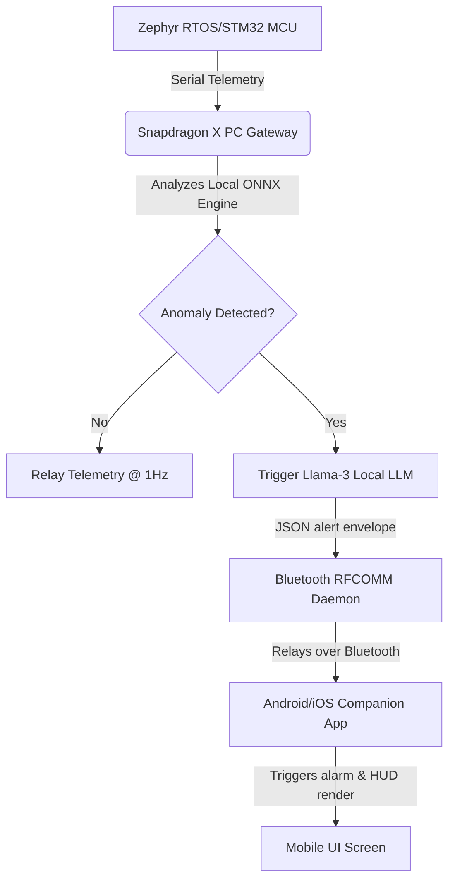

# EV Guardian — Smartphone Bluetooth Companion App Guide
This guide provides the complete blueprint, mobile code templates, and permission protocols to build a companion app (iOS/Android) that pairs with the Snapdragon PC and renders the live edge telemetry and LLM diagnostic reports over Bluetooth RFCOMM fully offline.

---



---

## 🛠️ Phase 1: Android & iOS Bluetooth Permissions

To handle local Bluetooth connections on mobile devices, update your app configuration files:

### 🤖 Android Manifest (`android/app/src/main/AndroidManifest.xml`)
Add the following permission lines inside the compiler container:
```xml
<uses-permission android:name="android.permission.BLUETOOTH" />
<uses-permission android:name="android.permission.BLUETOOTH_ADMIN" />
<uses-permission android:name="android.permission.BLUETOOTH_SCAN" />
<uses-permission android:name="android.permission.BLUETOOTH_CONNECT" />
<uses-permission android:name="android.permission.ACCESS_FINE_LOCATION" />
```

### 🍎 iOS Info.plist (`ios/Runner/Info.plist`)
Request local sharing attributes:
```xml
<key>NSBluetoothAlwaysUsageDescription</key>
<string>EV Guardian uses Bluetooth to receive hardware telemetry and LLM diagnostic warnings from the vehicle Snapdragon co-processor.</string>
<key>NSBluetoothPeripheralUsageDescription</key>
<string>EV Guardian uses Bluetooth to monitor battery cell temperatures.</string>
```

---

## 📱 Phase 2: Companion App Code Template (Flutter / Dart)
Using the premium `flutter_bluetooth_serial` package, here is the complete connection coordinator and parsing logic to read raw RFCOMM byte buffers:

```dart
import 'dart:convert';
import 'dart:typed_data';
import 'package:flutter/material.dart';
import 'package:flutter_bluetooth_serial/flutter_bluetooth_serial.dart';

class BluetoothTelemetryScreen extends StatefulWidget {
  @override
  _BluetoothTelemetryScreenState createState() => _BluetoothTelemetryScreenState();
}

class _BluetoothTelemetryScreenState extends State<BluetoothTelemetryScreen> {
  BluetoothConnection? connection;
  bool isConnected = false;
  String connectionStatus = "Disconnected. Scan to pair...";
  
  // Real-time variables
  List<double> voltages = [0.0, 0.0, 0.0, 0.0];
  List<double> temperatures = [0.0, 0.0, 0.0, 0.0];
  double current = 0.0;
  double sohPct = 100.0;
  
  // LLM Diagnostics state
  bool isAnomaly = false;
  String diagnosticAdvice = "No active faults detected. System stable.";
  String buffer = ""; // Store partial chunk outputs

  @override
  void initState() {
    super.initState();
    // Prompt Bluetooth pairing layout
  }

  void connectToSnapdragon(BluetoothDevice device) async {
    setState(() {
      connectionStatus = "Connecting to ${device.name}...";
    });

    try {
      connection = await BluetoothConnection.toAddress(device.address);
      setState(() {
        isConnected = true;
        connectionStatus = "Connected to Snapdragon Edge-PC";
      });

      // Listening socket stream loop
      connection!.input!.listen((Uint8List data) {
        String dataString = utf8.decode(data);
        buffer += dataString;

        // Extract JSON lines parsed on newlines (\n)
        while (buffer.contains('\n')) {
          int newlineIndex = buffer.indexOf('\n');
          String jsonLine = buffer.substring(0, newlineIndex).trim();
          buffer = buffer.substring(newlineIndex + 1);

          if (jsonLine.isNotEmpty) {
            parseTelemetryPacket(jsonLine);
          }
        }
      }).onDone(() {
        setState(() {
          isConnected = false;
          connectionStatus = "Link Loss. Disconnected.";
        });
      });

    } catch (exception) {
      setState(() {
        connectionStatus = "Connection Failed: $exception";
      });
    }
  }

  void parseTelemetryPacket(String rawJson) {
    try {
      Map<String, dynamic> packet = jsonDecode(rawJson);
      
      if (packet['type'] == 'handshake') {
        print("Handshake OK: ${packet['device']}");
        return;
      }
      
      setState(() {
        voltages = List<double>.from(packet['voltages'].map((x) => x.toDouble()));
        temperatures = List<double>.from(packet['temperatures'].map((x) => x.toDouble()));
        current = packet['current'].toDouble();
        sohPct = packet['soh_pct'].toDouble();
        isAnomaly = packet['is_anomaly'] ?? false;
        
        if (packet['type'] == 'alert') {
          diagnosticAdvice = packet['diagnosis'] ?? "Anomaly flagged.";
        } else if (!isAnomaly) {
          diagnosticAdvice = "No active faults detected. System stable.";
        }
      });
    } catch (e) {
      print("Error parsing bluetooth buffer: $e");
    }
  }

  @override
  Widget build(BuildContext context) {
    return Scaffold(
      backgroundColor: Color(0xFF030611),
      appBar: AppBar(
        title: Text("EV GUARDIAN COMPANION"),
        backgroundColor: Colors.black85,
      ),
      body: Padding(
        padding: const EdgeInsets.all(16.0),
        child: Column(
          children: [
            // Status Banner
            Container(
              padding: EdgeInsets.all(12),
              color: isAnomaly ? Colors.redAccent.withOpacity(0.1) : Colors.cyan.withOpacity(0.05),
              child: Row(
                children: [
                  Icon(isAnomaly ? Icons.warning : Icons.check_circle, 
                       color: isAnomaly ? Colors.red : Colors.green),
                  SizedBox(width: 10),
                  Text(connectionStatus, style: TextStyle(color: Colors.white70, fontSize: 12)),
                ],
              ),
            ),
            SizedBox(height: 20),
            
            // Dials & Telemetry Display
            Row(
              mainAxisAlignment: MainAxisAlignment.spaceAround,
              children: [
                _buildStatMetric("SOH CAPACITY", "${sohPct.toStringAsFixed(1)}%"),
                _buildStatMetric("CURRENT", "${current.toStringAsFixed(1)} A"),
              ],
            ),
            
            SizedBox(height: 15),
            Text("CELL VOLTAGES V", style: TextStyle(color: Colors.white54, fontSize: 10)),
            Text(voltages.map((v) => v.toStringAsFixed(2)).join("  |  "),
                 style: TextStyle(color: Colors.cyanAccent, fontWeight: FontWeight.bold, fontSize: 16)),
            
            SizedBox(height: 30),
            
            // LLM Terminal Panel Output
            Expanded(
              child: Container(
                width: double.infinity,
                padding: EdgeInsets.all(14),
                decoration: BoxDecoration(
                  color: Colors.black,
                  border: Border.all(color: isAnomaly ? Colors.red : Colors.deepPurple, width: 1.5),
                  borderRadius: BorderRadius.circular(12),
                ),
                child: SingleChildScrollView(
                  child: Column(
                    crossAxisAlignment: CrossAxisAlignment.start,
                    children: [
                      Text("🤖 OFFLINE CO-PROCESSOR DIAGNOSIS:", 
                           style: TextStyle(color: Colors.deepPurpleAccent, fontWeight: FontWeight.bold, fontSize: 11)),
                      SizedBox(height: 8),
                      Text(diagnosticAdvice, 
                           style: TextStyle(color: Color(0xFFE2E8F0), fontFamily: 'monospace', fontSize: 12, height: 1.5)),
                    ],
                  ),
                ),
              ),
            ),
          ],
        ),
      ),
    );
  }

  Widget _buildStatMetric(String label, String value) {
    return Column(
      children: [
        Text(label, style: TextStyle(color: Colors.white54, fontSize: 10)),
        SizedBox(height: 4),
        Text(value, style: TextStyle(color: Colors.white, fontWeight: FontWeight.bold, fontSize: 20)),
      ],
    );
  }
}
```

---

## 🚀 Phase 3: Pairing & Operation Flow

1. **Activate Bluetooth on Host & Client:** Enable Bluetooth in Windows settings on the Snapdragon PC and Android/iOS settings on the smartphone.
2. **Execute Bluetooth Daemon on PC:**
   ```powershell
   python bluetooth_daemon.py
   ```
3. **Launch the Phone Mobile App:** Request Bluetooth permissions, scan, and select the Snapdragon host device address to pair.
4. **Trigger a Fault Demonstration:** Once the gateway transitions into an anomaly state, the local LLM running on the Snapdragon PC compiles the diagnostic response and transmits it instantly to the paired mobile phone. Keep all system outputs saved offline!

---

## 🔮 Phase 4: Qualcomm AI Hub SAM 2 AR Diagnostic Integration

To convert the companion app into a visual diagnostic tool, compile and load **Segment Anything Model 2 (SAM 2)** from the Qualcomm AI Hub to run locally on the OnePlus 15 NPU.

### 📥 1. Fetching the Quantized Models from Qualcomm AI Hub
Run these CLI commands in your hub environment to export the INT8/FP16 quantized Mobile TFLite models designed for Snapdragon 8 Gen 4/5 HTP:

```bash
# Log in and load target models
qai-hub-models compile --model "sam2_image_encoder" --device "OnePlus 15" --runtime "tflite" --output-dir "./assets"
qai-hub-models compile --model "sam2_prompt_decoder" --device "OnePlus 15" --runtime "tflite" --output-dir "./assets"
```

Save the generated models as assets in your Flutter codebase:
* `assets/models/sam2_image_encoder_quantized.tflite`
* `assets/models/sam2_prompt_decoder_quantized.tflite`

Add them to your project's `pubspec.yaml` assets block:
```yaml
flutter:
  assets:
    - assets/models/sam2_image_encoder_quantized.tflite
    - assets/models/sam2_prompt_decoder_quantized.tflite
```

### 📱 2. Implementing the AR Camera Overlay
We have created a complete, standalone Flutter overlay interface file at:
👉 **[mobile_sam2_ar_pipeline.dart](file:///c:/ev%20vechile/mobile_sam2_ar_pipeline.dart)**

To integrate it, add this widget call to your mobile view:
```dart
Navigator.push(
  context,
  MaterialPageRoute(
    builder: (context) => Sam2DiagnosticsARScreen(
      liveVoltages: voltages,
      liveTemperatures: temperatures,
      packetAnomaly: isAnomaly,
    ),
  ),
);
```
This runs the camera frame capture loop, resizes images to $1024 \times 1024$, feeds them to the Snapdragon HTP NNAPI delegate (`qti-npu`), extracts the segment masks under prompts, and highlights the physical battery cells green/yellow/red in real-time according to their respective voltage values!

